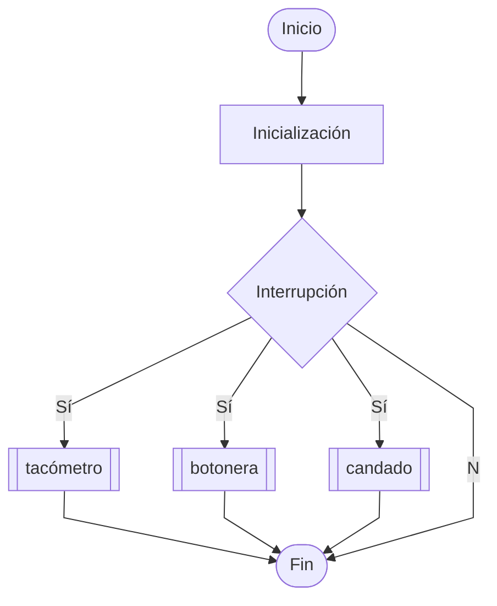

# Smart bike system

Sistema embebido que se acopla a una bicicleta para mejorar la experiencia de usuario con las funcionalidades de velocímetro, luces direccionales y alarma antirrobo

[Simulación en Wokwi](https://wokwi.com/projects/339436184287576659)

# Descripción del proyecto


El proyecto consiste en un sistema embebido conformado por una placa de desarrollo ESP32 que a través del sensor óptico permite monitorear constantemente la velocidad. Además cuenta con un sub-sistema de luces que al empezar el manejo de la bicicleta se encienden las luces, así mismo cuando desacelera la luz trasera se enciende, también cuenta con luces direccionales que a través de 3 pulsadores puedes encender luces de la izquierda, derecha o ambas. Por último, la funcionalidad de alarma antirrobo se inicia pulsando un botón “candado” que al detectar un movimiento brusco con el acelerómetro-giroscopio empieza a emitir una alarma muy similar a la de los automóviles.

## Comenzando ****🚀****

---

El trabajo se realizó mediante una simulación en la plataforma de [Wokwi](https://wokwi.com/), en donde se utilizó la placa de desarrollo ESP32 programada en lenguaje C++.  Para poder realizar la simulación, este repositorio cuenta con 3 archivos:

- SmartBikeSystem.ino
- settings.h
- diagram.json

Estos tres se deben colocar en la plataforma para poder realizar la simulación}


## Diagrama de flujo

---


```mermaid
%%{ init:{"flowchart":{"curve":"linear"}}}%%
flowchart TD
S([Inicio]);I[Inicialización];E([Fin])
C1{Interrupción}
B1[[tacómetro]];B2[[botonera]];B3[[candado]]
S-->I-->C1--Sí-->B1 & B2 & B3-->E
C1--No-->E
```

### Velocímetro

Medir tiempos entre interrupciones del ENCODER, seguido de hallar la distancia y velocidad asumiendo que el valor del diámetro de la mayoría de las bicicletas es de 26 pulgadas.

```arduino
long t_lastPulse;
float dt;
float diametro = 26;
float dist = 0, vel = 0, vel_last=0;
bool FLAG_ENCODER = false;

void IRAM_ATTR isrEncoder() {
  if (!FLAG_ENCODER) {
    FLAG_ENCODER = true;
    dt = millis() - t_lastPulse;
    t_lastPulse = millis(),
    dist = diametro * PI * 0.0000254 + dist;
    vel = diametro * PI * 0.0000254 / dt * 3600000.0;
    digitalWrite(ledFront, true);
    if (vel_last < vel){
      digitalWrite(ledStop, true);
    }
    else{
      digitalWrite(ledStop, false);
    }
    vel_last=vel;
  }
}
```

### Botonera

Recibe los datos de los botones para las funcionalidades

1. Botón derecha —> enciende intermitentemente los leds de la derecha
2. Botón de la izquierda —> enciende intermitentemente los leds de la izquierda
3. Botón baliza—>enciende intermitentemente los leds de la derecha e izquierda
4. Botón candado—> en caso que el giroscopio detecte movimiento, sonará la alarma

### Candado

La Interrupción del botón candado espera la respuesta de una señal por parte del giroscopio.

Si hay movimiento—> activa buzzer y luces intermitentes hasta que lo desactiven el candado presionando nuevamente el mismo botón.

## Componentes electrónicos principales

---

- ESP32 - microcontrolador
- TCRT5000 - sensor óptico
- MPU6050 - giroscopio
- SFM-20B - buzzer
- botonera de 4 botones
- led board frontal
- led board trasero
- PowerBank

## Pruebas previas

---

[ESP32 - TCRT5000 module](Smart%20bike%20system%20c67727ec1591481a852d080379d615c9/ESP32%20-%20TCRT5000%20module%20da778a292f364e30940a06a54f6ccd36.md)

[ESP32 - MPU6050](Smart%20bike%20system%20c67727ec1591481a852d080379d615c9/ESP32%20-%20MPU6050%2090b77dc2f4574e6d97a5f4903c915c24.md)

[ESP32 - Buzzer](Smart%20bike%20system%20c67727ec1591481a852d080379d615c9/ESP32%20-%20Buzzer%20f184e5d21ba74e65b0f9adccf7e0575f.md)

[ESP32 - Timer para luces direccionales](Smart%20bike%20system%20c67727ec1591481a852d080379d615c9/ESP32%20-%20Timer%20para%20luces%20direccionales%2041a8a0a9a2bc4c6c8893d682d065cfa6.md)


## PCB

---


Modificaciones a la PCB:

1. La resistencia R15 está demás
2. Verificar si cambiará la entrada de alimentación P3 (tipo C/micro USB)
3. La botonera P6 debe tener conectada la entrada 1 al pin D18 y eliminar el R19 (todos los botones son pulsadores) (en la botonera son 4 botones sin resistencias)
4. Giroscopio G1 está correcto
5. P4 cambiar a un conector de 4 pines, para luego conectar el módulo TCRT5000) y conectar el D al pin 35; y el VCC del módulo a 3.3V y GND con GND, Además cambiar la lógica de true a false en el pin encoder de ser necesario
6. El D13 qué simboliza? No está programado
7. En el pin D25 Luces de señalización es la luz que se enciende cuando avanza la bicicleta y se mantiene encendido
8. Confirmar el R11.

## Mejoras a futuro

---

### Funcionalidades

1. Velocímetro: Medición de velocidad y distancia recorrida
2. Antirrobo: Sistema de alarma en caso de detectar movimiento
3. Keypad: Sistema de botones para encendido de luces delanteras, traseras y direccionales
4. Luces direccionales: Sistema de parpadeo de luces
5. Pantalla: (En prospecto)
6. Bluetooth: (En prospecto)

<aside>
💡 ¿Cómo detectar un componente que esté conectado al sistema? Por ejemplo en un led o un buzzer. En una comunicación I2C si se puede detectar el estado de conexión.

</aside>